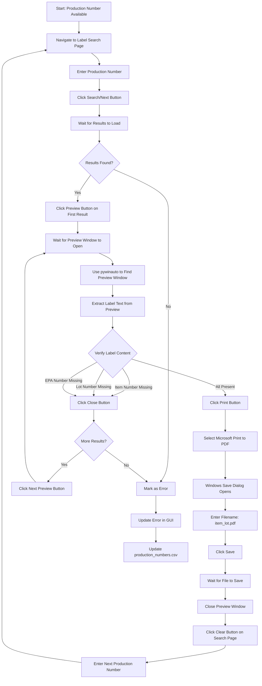

# Phase 2.2: Label Search and Download Automation Plan

## Overview

This plan implements automated label search, verification, and download using a hybrid approach:

- **Selenium** (Edge IE mode): Navigate, search, click preview buttons
- **pywinauto/pyautogui**: Interact with ActiveX preview window (print button, file dialogs)
- **Label verification**: Check for item number, lot number, and EPA number presence

## Current State Analysis

### What Works

- Production number search using Edge IE mode (`EnlabelAutomation.search_production_number()`)
- Login automation
- Production numbers stored in `data/verification/production_numbers.csv`

### What Needs Implementation

- Label search navigation and search functionality
- Preview button clicking
- ActiveX preview window interaction
- Label content verification (item/lot/EPA numbers)
- Print button automation
- Windows file save dialog automation
- Error tracking and reporting

## Architecture Flow



## Implementation Components

### 1. New Module: `src/label_automation.py`

**Purpose**: Handle label search, preview, verification, and download automation.

**Key Methods**:

- `search_labels_by_production_number(production_number: str) -> List[WebElement]`: Navigate to label search page, enter production number, return list of result rows
- `click_preview_button(result_index: int) -> None`: Click preview button for a specific result row
- `wait_for_preview_window(timeout: int) -> bool`: Wait for ActiveX preview window to open
- `verify_label_content(item_number: str, lot_number: str) -> bool`: Use pywinauto to extract text from preview window and verify item/lot/EPA numbers
- `print_and_save_label(item_number: str, lot_number: str, output_path: Path) -> bool`: Click print button, handle printer selection, save file dialog
- `close_preview_window() -> None`: Close the preview window
- `clear_label_search() -> None`: Click clear button and reset search form
- `process_all_labels_for_production_number(production_number: str, item_number: str, lot_number: str, output_dir: Path) -> dict`: Main orchestration method

**Dependencies**:

- `selenium` (already in use)
- `pywinauto` (needs to be added to requirements.txt)
- `pyautogui` (needs to be added to requirements.txt, fallback for dialogs)

### 2. Update: `src/enlabel_automation.py`

**New Methods**:

- `navigate_to_label_search() -> None`: Navigate to label search page URL
- `search_labels(production_number: str) -> List[WebElement]`: Search for labels by production number
- `get_label_results() -> List[WebElement]`: Get all result rows from label search results table
- `click_label_preview(result_index: int) -> None`: Click preview button for specific result

**Integration Points**:

- Reuse existing `_wait_ready_and_ajax()` method
- Reuse existing `_switch_into_frame_if_needed()` method
- Reuse existing browser session from production number search

### 3. New Module: `src/label_verifier.py`

**Purpose**: Verify label content from preview window text extraction.

**Key Methods**:

- `extract_text_from_preview_window(window_handle) -> str`: Use pywinauto to extract all text from preview window
- `verify_label_has_item_number(text: str, item_number: str) -> bool`: Check if item number is present
- `verify_label_has_lot_number(text: str, lot_number: str) -> bool`: Check if lot number is present
- `verify_label_has_epa_number(text: str) -> bool`: Check if EPA number exists (any format)
- `verify_label_complete(text: str, item_number: str, lot_number: str) -> bool`: Combined verification

**Note**: This differs from the original plan (PDF verification) - we're verifying from the preview window text instead.

### 4. New Module: `src/windows_automation.py`

**Purpose**: Handle Windows-specific automation (preview window, dialogs).

**Key Methods**:

- `find_preview_window(timeout: int) -> WindowSpecification`: Find ActiveX preview window by title/class
- `click_print_button(window) -> None`: Click print button in preview window
- `select_printer(printer_name: str = "Microsoft Print to PDF") -> None`: Handle printer selection dialog
- `handle_save_dialog(filepath: Path) -> None`: Handle Windows file save dialog
- `close_preview_window(window) -> None`: Close preview window
- `wait_for_window_by_title(title_pattern: str, timeout: int) -> WindowSpecification`: Generic window finder

**Dependencies**:

- `pywinauto` (primary)
- `pyautogui` (fallback for dialogs if pywinauto fails)

### 5. Update: `config/config.yaml`

**New Sections**:

```yaml
label_search:
  url: "https://pallprod.enlabel.com/ProductionPrint/PrintTypes/PrintByOrder/PrintStart.aspx?ServiceId=10"
  production_number_input: "ctl00_MainContent__txtORDER_NUMBER"
  search_button: "ctl00_MainContent__btnNext"  # Needs to be verified
  clear_button: "ctl00_MainContent__btnClear"  # Needs to be verified
  results_table: "ctl00_MainContent_gridLabels"
  preview_button_pattern: "ctl00_MainContent_gridLabels_ctl00_ctl{index}_btnPreview"

windows_automation:
  preview_window_title_pattern: "Label Preview"  # Needs to be verified
  preview_window_class_pattern: "Internet Explorer_Server"  # Needs to be verified
  print_button_text: "Print"  # Needs to be verified
  close_button_text: "Close"  # Needs to be verified
  printer_name: "Microsoft Print to PDF"
  save_dialog_timeout: 30
  preview_load_timeout: 15

label_verification:
  item_number_required: true
  lot_number_required: true
  epa_number_required: true
  epa_pattern: "EPA"  # Case-insensitive search for "EPA" text
```

**Fix**: Correct typo `label_searh` → `label_search` in existing config.

### 6. Update: `src/main.py`

**New Method in `FIFRAAutomation`**:

- `_process_labels(production_numbers_df: pd.DataFrame) -> pd.DataFrame`: Main orchestration for label processing
  - Loop through each production number
  - Call label automation for each
  - Track success/failure
  - Update GUI progress
  - Save error results

**Update `process_files()` method**:

- Add call to `_process_labels()` after production number search
- Update progress tracking
- Display label processing results in GUI

### 7. Update: `src/gui.py`

**New Features**:

- Display label processing progress
- Show errors for labels that couldn't be found/verified
- Display count of successfully downloaded labels
- Error list display (item, lot, production number, error reason)

### 8. Update: `data/verification/production_numbers.csv`

**New Columns**:

- `label_found`: boolean (True if label was found and verified)
- `label_error`: string (error message if label processing failed)
- `label_file_path`: string (path to saved label PDF if successful)

## Research & Testing Requirements

### Critical Research Tasks (Must Complete Before Implementation)

1. **Label Search Page Structure**

   - [ ] Navigate to label search URL manually
   - [ ] Identify exact locators for:
     - Production number input field
     - Search/Next button
     - Clear button
     - Results table structure
     - Preview button XPath pattern
   - [ ] Test if page uses iframes
   - [ ] Document wait times for page load

2. **Preview Window Properties** (CRITICAL)

   - [ ] Manually open a label preview
   - [ ] Use Spy++ or similar tool to capture:
     - Window title (exact text)
     - Window class name
     - Window handle properties
   - [ ] Take screenshot of preview window
   - [ ] Identify print button:
     - Location (relative to window)
     - Text/label
     - Can it be found by text search?
     - Can it be found by image recognition?
   - [ ] Identify close button properties
   - [ ] Test window detection with pywinauto:
     ```python
     from pywinauto import Application
     app = Application().connect(title_re=".*Label Preview.*")
     ```


3. **Label Content Verification**

   - [ ] Open multiple label previews manually
   - [ ] Document where item numbers appear in preview
   - [ ] Document where lot numbers appear in preview
   - [ ] Document where EPA numbers appear in preview
   - [ ] Test text extraction from preview window using pywinauto
   - [ ] Verify text extraction is reliable across different labels

4. **Print and Save Dialog Flow**

   - [ ] Click print button manually
   - [ ] Document printer selection dialog:
     - Window title
     - How to select "Microsoft Print to PDF"
   - [ ] Document file save dialog:
     - Window title
     - How to enter filename
     - How to select save location
     - How to click Save button
   - [ ] Test automation of full flow with pywinauto/pyautogui

5. **Error Scenarios**

   - [ ] Test: What happens if no labels found for production number?
   - [ ] Test: What happens if preview window doesn't open?
   - [ ] Test: What happens if all labels are incorrect (no matching item/lot)?
   - [ ] Test: What happens if file save dialog fails?
   - [ ] Test: What happens if browser loses connection during process?

### Testing Scripts to Create

1. **`testing/test_label_search.py`**

   - Test navigation to label search page
   - Test entering production number
   - Test clicking search button
   - Test extracting result rows
   - Test clicking preview buttons

2. **`testing/test_preview_window.py`**

   - Test finding preview window with pywinauto
   - Test extracting text from preview window
   - Test clicking print button
   - Test closing preview window

3. **`testing/test_label_verification.py`**

   - Test verifying item number in label text
   - Test verifying lot number in label text
   - Test verifying EPA number in label text
   - Test complete verification flow

4. **`testing/test_print_save_flow.py`**

   - Test full flow: preview → print → printer selection → save dialog
   - Test with different label types
   - Test error handling

## Implementation Steps

### Step 1: Research Phase (Critical)

1. Complete all research tasks listed above
2. Document findings in `PRE_IMPLEMENTATION_CHECKLIST.md`
3. Create test scripts to verify each component works independently
4. Take screenshots and document window properties

### Step 2: Configuration Updates

1. Fix typo in `config.yaml` (`label_searh` → `label_search`)
2. Add all new configuration sections
3. Add locators discovered during research

### Step 3: Windows Automation Module

1. Create `src/windows_automation.py`
2. Implement preview window finder
3. Implement print button clicker
4. Implement printer selection
5. Implement file save dialog handler
6. Test with manual preview windows

### Step 4: Label Verifier Module

1. Create `src/label_verifier.py`
2. Implement text extraction from preview window
3. Implement verification methods
4. Test with known good/bad labels

### Step 5: Label Automation Module

1. Create `src/label_automation.py`
2. Implement label search navigation
3. Implement preview button clicking
4. Integrate with windows_automation and label_verifier
5. Implement main orchestration method

### Step 6: Enlabel Automation Updates

1. Add label search methods to `EnlabelAutomation` class
2. Integrate with existing browser session
3. Test navigation flow

### Step 7: Main Orchestrator Updates

1. Update `main.py` to call label processing
2. Add error tracking
3. Update CSV output with label status
4. Update GUI to show label processing progress

### Step 8: Error Handling & Edge Cases

1. Handle "no labels found" scenario
2. Handle "all labels incorrect" scenario
3. Handle preview window timeout
4. Handle file save failures
5. Handle browser connection loss
6. Add retry logic for transient failures

### Step 9: Integration Testing

1. Test full flow with single production number
2. Test with multiple production numbers
3. Test error scenarios
4. Verify files are saved correctly
5. Verify CSV is updated correctly
6. Verify GUI displays errors correctly

### Step 10: Documentation

1. Update README.md with new phase 2.2 details
2. Document any limitations or known issues
3. Update troubleshooting section

## Dependencies to Add

Add to `requirements.txt`:

```
pywinauto>=0.6.8
pyautogui>=0.9.54
Pillow>=10.0.0  # Required by pyautogui for image recognition
```

## Error Tracking Structure

Errors will be tracked in:

1. **GUI**: Display in status area with item/lot/production number and error reason
2. **CSV**: `production_numbers.csv` with `label_found=False` and `label_error="reason"`
3. **Logs**: Detailed error logs in `logs/fifra_automation.log`

Error reasons to track:

- "No labels found for production number"
- "Preview window did not open"
- "Label verification failed: missing item number"
- "Label verification failed: missing lot number"
- "Label verification failed: missing EPA number"
- "Print button not found"
- "File save dialog failed"
- "All labels checked, none matched item/lot"

## File Naming Convention

Labels will be saved as: `{item_name}_{lot_number}.pdf`

- Example: `NP6MSTGQP1_UE4376.pdf`
- Saved to: `output/{trip_number}/labels/`

## Key Challenges & Solutions

1. **Preview Window Detection**

   - Challenge: Finding ActiveX preview window reliably
   - Solution: Use pywinauto with window title/class patterns, add timeout and retry logic

2. **Text Extraction from Preview**

   - Challenge: Extracting text from ActiveX control
   - Solution: Use pywinauto's `window_text()` or `element_info.name` properties, may need OCR fallback

3. **EPA Number Verification**

   - Challenge: EPA number format may vary
   - Solution: Search for "EPA" text presence (case-insensitive), don't validate format

4. **File Save Dialog**

   - Challenge: Windows dialog automation can be fragile
   - Solution: Use pywinauto primarily, pyautogui as fallback, add robust error handling

5. **Multiple Labels per Production Number**

   - Challenge: Need to iterate through all labels until correct one found
   - Solution: Loop through result rows, check each preview, continue if incorrect

6. **Browser Session Management**

   - Challenge: Keeping browser session alive during long operations
   - Solution: Reuse existing `EnlabelAutomation` instance, add connection health checks

## Success Criteria

Phase 2.2 is complete when:

- [ ] Can search for labels by production number
- [ ] Can open preview windows reliably
- [ ] Can verify label content (item/lot/EPA)
- [ ] Can print and save labels with correct naming
- [ ] Can handle errors gracefully (no labels found, incorrect labels, etc.)
- [ ] Errors are tracked in GUI and CSV
- [ ] Full flow works end-to-end for multiple production numbers
- [ ] Files are saved to correct location with correct names