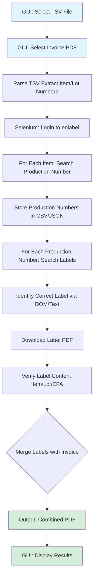

# FIFRA Label Automation Plan

## Overview

Automate the process of extracting production numbers from enlabel, downloading digital labels, verifying label content, and combining them with shipping invoices for FIFRA shipments.

## Architecture



## Key Components

### 1. Data Input Handler (`src/data_parser.py`)

- Parse TSV file from Oracle ERP
- Extract item numbers and lot numbers
- Validate data structure
- Handle missing/invalid entries

### 2. Enlabel Automation (`src/enlabel_automation.py`)

- Selenium WebDriver setup with Firefox
- Login automation (already tested)
- Production number search automation
- Label search and identification
- Handle multiple browser windows
- Explicit waits for variable loading times
- Store production numbers in verification file (CSV/JSON)

### 3. Label Download Manager (`src/label_downloader.py`)

- Configure Firefox download preferences (auto-save to predefined folder)
- Alternative: Use `pyautogui` for Windows dialog automation if browser config doesn't work
- Track downloaded files
- Handle file naming conflicts

### 4. Label Verification (`src/label_verifier.py`)

- Extract text from PDF labels using PyPDF2 or pdfplumber
- Verify presence of: item number, lot number, EPA number
- If text extraction fails, use OCR (Tesseract/pytesseract) as fallback
- Log verification results
- Flag labels missing required information

### 5. PDF Merger (`src/pdf_merger.py`)

- Combine all verified labels into single PDF
- Merge with shipping invoice PDF (separate file)
- Maintain proper order
- Handle page orientation/sizing

### 6. GUI Interface (`src/gui.py`)

- Simple tkinter-based GUI window
- File picker dialogs for TSV file selection
- File picker dialog for shipping invoice PDF selection
- Progress bar and status messages
- Start/Stop automation controls
- Display verification results

### 7. Main Orchestrator (`src/main.py`)

- Coordinate all components
- Error handling and logging
- Progress tracking
- User-friendly output
- Can be run with GUI or command-line interface

### 8. Configuration (`config/config.yaml`)

- Enlabel credentials (or use environment variables)
- Download folder paths
- Browser preferences
- Retry settings
- Timeout values

## Technical Stack

- **Selenium**: Browser automation
- **pandas**: TSV parsing and data manipulation
- **PyPDF2/pdfplumber**: PDF text extraction and merging
- **pytesseract**: OCR fallback for label verification
- **pyautogui**: Windows dialog automation (if needed)
- **tkinter**: GUI interface (built-in with Python)
- **logging**: Comprehensive logging
- **configparser/yaml**: Configuration management

## Implementation Strategy

### Phase 1: Core Infrastructure

1. Set up project structure with virtual environment
2. Create configuration system
3. Implement TSV parser
4. Set up logging framework
5. Create basic GUI with file picker dialogs

### Phase 2: Enlabel Automation

1. Extend existing login script
2. Implement production number search
3. Add label search functionality
4. Handle multiple windows and waits
5. Create production number storage system

### Phase 3: Label Download & Verification

1. Configure browser download preferences
2. Implement label download automation
3. Create label verification system (start with text extraction)
4. Add OCR fallback if needed
5. Test with sample labels

### Phase 4: PDF Processing

1. Implement PDF merger
2. Add invoice integration
3. Test end-to-end flow

### Phase 5: Error Handling & Polish

1. Add comprehensive error handling
2. Implement retry logic
3. Add progress indicators
4. Create user documentation

## Key Challenges & Solutions

1. **Multiple labels per item**: Investigate DOM structure to identify correct label (check for item/lot/EPA in label name or metadata)
2. **Label verification**: Start with PDF text extraction, fallback to OCR if needed
3. **Windows file dialog**: Configure Firefox download preferences first; use pyautogui as backup
4. **Variable wait times**: Use Selenium explicit waits (WebDriverWait) with configurable timeouts
5. **New browser windows**: Use window handles to switch between windows
6. **Production number storage**: CSV file for easy verification and debugging

## File Structure

```javascript
fifra-automation-cytiva/
├── src/
│   ├── __init__.py
│   ├── main.py
│   ├── gui.py
│   ├── data_parser.py
│   ├── enlabel_automation.py
│   ├── label_downloader.py
│   ├── label_verifier.py
│   └── pdf_merger.py
├── config/
│   └── config.yaml
├── data/
│   ├── input/          # TSV files from Oracle ERP
│   ├── invoices/       # Shipping invoice PDFs
│   ├── labels/         # Downloaded labels
│   ├── output/         # Combined PDFs
│   └── verification/   # Production numbers CSV
├── logs/
├── requirements.txt
├── README.md
└── .env.example        # Template for credentials
```

## Next Steps

1. Investigate enlabel DOM structure to understand how labels are identified
2. Test label text extraction to determine if OCR is needed
3. Set up project structure and dependencies
