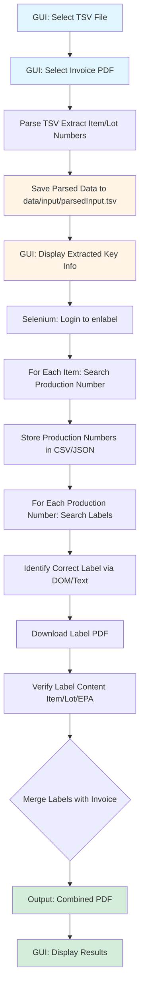

# FIFRA Label Automation Plan


## Architecture



**Note**: The "Download Label PDF" step (K) in the architecture diagram is currently **BLOCKED** due to Edge IE Mode + Selenium incompatibility. See the "Critical Issues & Blockers" section for details and possible workarounds.

## Key Components

### 1. Data Input Handler (`src/data_parser.py`)

- Parse TSV file from Oracle ERP
- Extract item numbers and lot numbers
- Filter out container names (items starting with "CC-")
- Remove any duplicates, same item can have different lot numbers
- Extract shipment trip identifier (for folder organization)
- Extract shipment Tracking identifier
- Validate data structure
- Handle missing/invalid entries
- Save parsed data to `data/input/parsedInput.tsv` (intermediary step)

### 2. Enlabel Automation (`src/enlabel_automation.py`)

- Selenium WebDriver setup with Microsoft Edge
- Login automation (already tested - see `testing/login-test.py`)
- Production number search automation (tested and working)
- Label search and identification
- Handle multiple browser windows
- Explicit waits for variable loading times (wait for document ready + jQuery idle)
- Iframe handling for page context switching
- Store production numbers in verification file (CSV/JSON)
- Helper functions:
  - `_wait_ready_and_ajax()`: Wait for document ready and jQuery idle
  - `_switch_into_frame_if_needed()`: Handle iframe context switching

### 3. Label Download Manager (`src/label_downloader.py`) ⚠️ BLOCKED

**Status**: Label download automation is currently blocked due to Edge IE Mode + Selenium incompatibility (see "Critical Issues & Blockers" section).

**Original Planned Functionality:**
- Configure Edge download preferences (auto-save to predefined folder)
- Alternative: Use `pyautogui` for Windows dialog automation if browser config doesn't work
- Download labels to trip-specific output folder with the name of (item)_(lot number)
- Track downloaded files
- Handle file naming conflicts

**Current Limitations:**
- Cannot automate label downloads due to ActiveX requirement (Edge IE mode) and Selenium incompatibility
- Possible workarounds documented in "Critical Issues & Blockers" section
- Semi-automated mode may be implemented as fallback (user manually handles preview/print/save)

### 4. Label Verification (`src/label_verifier.py`)

- Extract text from PDF labels using PyPDF2 or pdfplumber
- Verify presence of: item number, lot number, EPA number
- If text extraction fails, use OCR (Tesseract/pytesseract) as fallback
- Log verification results
- Flag labels missing required information

### 5. PDF Merger (`src/pdf_merger.py`)

- Combine all verified labels into single PDF
- Merge with shipping invoice PDF (separate file)
- Save combined PDF to trip-specific output folder with the specified name of Trip (trip number)_Tracking (tracking number)
- Copy invoice PDF to trip-specific output folder
- Maintain proper order
- Handle page orientation/sizing

### 6. GUI Interface (`src/gui.py`)

- Simple tkinter-based GUI window
- File picker dialogs for TSV file selection
- File picker dialog for shipping invoice PDF selection
- Progress bar and status messages
- Start/Stop automation controls
- Display verification results

### 7. Main Orchestrator (`src/main.py`)

- Coordinate all components
- Create trip-specific output folder structure
- Error handling and logging
- Progress tracking
- User-friendly output
- Can be run with GUI or command-line interface

### 8. Configuration (`config/config.yaml`)

- Enlabel credentials (or use environment variables)
- Download folder paths
- Browser preferences
- Retry settings
- Timeout values

## Technical Stack

- **Selenium**: Browser automation
- **pandas**: TSV parsing and data manipulation
- **PyPDF2/pdfplumber**: PDF text extraction and merging
- **pytesseract**: OCR fallback for label verification
- **pyautogui**: Windows dialog automation (if needed)
- **tkinter**: GUI interface (built-in with Python)
- **logging**: Comprehensive logging
- **configparser/yaml**: Configuration management

## Data Structure & Implementation Details

### TSV File Structure

The TSV files exported from Oracle ERP contain the following key columns:

- **Trip**: Shipment trip identifier (first column)
- **Tracking Number**: Shipment tracking identifier (8th column)
- **Item Name**: Product/item identifier (5th column, e.g., "NP6MSTGQP1" exclude the item names starting with CC- these are the names of the containers)
- **Lot**: Lot number for the item (10th column, e.g., "UE4376", "UE4955")

**Note**:

- Lot numbers that are 9-digit numbers are already production numbers and do not need to be searched.
- Container names (Item Name starting with "CC-") are automatically excluded from processing as they are not relevant for label processing.

**Edge Cases**:

- Empty/missing values in columns (flag for manual confirmation)
- Multiple lots per item (one item can have different lot numbers)
- No special characters expected in data
- Container names (items starting with "CC-") are filtered out automatically

### Enlabel Website Details

#### Authentication

- **Login URL**: `https://pallprod.enlabel.com/Login.aspx?ReturnUrl=%2f`
- **Username Field**: ID = `ctl00_ContentPlaceHolder1_txtUserName`
- **Password Field**: ID = `ctl00_ContentPlaceHolder1_txtPassword`
- **Login Button**: ID = `ctl00_ContentPlaceHolder1_btnLogin`
- **Browser**: Microsoft Edge (tested and working)
- **Network Requirements**: Must run from Cytiva network

#### Production Number Search Flow

1. **Navigate to ManageDatabases**:
   - URL: `https://pallprod.enlabel.com/Collaboration/ManageDatabases/ManageDatabases.aspx`
   - Wait for page load (document ready + jQuery idle check)

2. **Open Database Record**:
   - Locate grid table: XPath contains `gridTables`
   - Click the link in the second data row (index `__1`)
   - Wait for records view to load

3. **Set Filter for Lot Number Search**:
   - Operand dropdown: ID contains `FilterControl_ddlOperand1` (select 2nd option, index 1)
   - Column dropdown: ID contains `FilterControl_ddlColumn1` (select 9th option, index 8)
   - Value input: ID = `ctl00_MainContent_FilterControl_txtValue1` (enter lot number)
   - Find button: ID = `ctl00_MainContent_FilterControl_btnFind`

4. **Extract Production Number**:
   - Production number element: XPath = `//*[@id='ctl00_MainContent_gridDbRecords_ctl00__0']/td[2]/nobr`
   - Extract text content from this element

**Important Implementation Notes**:

- Use iframe handling (`_switch_into_frame_if_needed`) - the page may use iframes
- Wait for document ready state and jQuery idle: `_wait_ready_and_ajax`
- Use explicit waits (WebDriverWait) with timeouts (typically 10-40 seconds)
- Handle StaleElementReferenceException with retries
- Use JavaScript click (`driver.execute_script("arguments[0].click();", element)`) if regular click fails

## Implementation Strategy

### Phase 1: Core Infrastructure

1. Set up project structure with virtual environment
2. Create configuration system
3. Implement TSV parser
4. Set up logging framework
5. Create basic GUI with file picker dialogs

### Phase 2.1: Enlabel production number search

1. Implement production number search using the login-test.py file as a guide to the navigation path and correct selectors.

### Phase 2.2: Enlabel Label Download & Verification ⚠️ BLOCKED

**Status**: Cannot be completed as originally planned due to Edge IE Mode + Selenium incompatibility (see "Critical Issues & Blockers" section).

**Original Plan:**
1. Add label search functionality
2. Handle multiple windows and waits
3. Create production number storage system
4. Configure browser download preferences
5. Implement label download automation ❌ **BLOCKED**
6. Create label verification system (start with text extraction)
7. Add OCR fallback if needed
8. Test with sample labels


### Phase 3: PDF Processing

1. Implement PDF merger
2. Add invoice integration
3. Test end-to-end flow

### Phase 4: Error Handling & Polish

1. Add comprehensive error handling
2. Implement retry logic
3. Add progress indicators
4. Create user documentation

## Critical Issues & Blockers

### ⚠️ Label Download Automation Blocked by Edge IE Mode + Selenium Incompatibility

**Problem Statement:**

The label download process cannot be fully automated with the current technical constraints:

1. **Edge IE Mode Requirement**: The label preview functionality requires Microsoft Edge to be opened in Internet Explorer (IE) mode to support ActiveX controls, which are necessary for the label template to load and render.

2. **Selenium Incompatibility**: When Edge is launched in IE mode, Selenium WebDriver loses control over the browser. Selenium cannot interact with or automate browsers running in IE compatibility mode, making it impossible to use Selenium for the label download workflow.

3. **ActiveX-Based Rendering**: The label system uses ActiveX controls that:
   - Load label templates and data from the server
   - Render the label preview on the client side (not as a PDF)
   - Require Windows dialogs (print dialog, file save dialog) to export to PDF
   - Cannot be reverse-engineered via API calls since rendering happens client-side

4. **Workflow Breakdown**: The workflow requires:
   - Preview button click (works with Selenium in normal Edge mode)
   - ActiveX preview window (requires IE mode, breaks Selenium)
   - Print button in preview window (ActiveX control, not accessible via Selenium)
   - Printer selection dialog (Windows native dialog)
   - File save dialog (Windows native dialog)

**Impact:**

- Phase 2.2 (Label Download & Verification) cannot be completed as originally planned
- Full end-to-end automation of label downloads is currently not feasible
- Manual intervention is required for the label download step

**Possible Solutions & Workarounds (Brainstormed):**

1. **Hybrid Automation Approach** ⭐ (Most Promising)
   - **Concept**: Use Selenium for navigation and preview button clicking (in normal Edge mode), then switch to Windows automation tools (pywinauto/pyautogui) to handle the preview window and dialogs
   - **Implementation**: 
     - Launch Edge in normal mode with Selenium
     - Use Selenium to navigate, search, and click preview button
     - When preview window opens (in IE mode automatically), use pywinauto to:
       - Find the ActiveX preview window by title/class name
       - Click the print button in the preview window
       - Handle printer selection dialog (select "Microsoft Print to PDF")
       - Handle file save dialog (enter path and filename, click save)
   - **Challenges**: 
     - Need to identify preview window reliably (window title/class)
     - Timing synchronization between Selenium actions and Windows dialogs
     - Screen resolution/scaling affects pyautogui coordinates
     - May require Spy++ or similar tools to inspect window properties
   - **Feasibility**: Medium-High (requires Windows automation expertise and testing)

3. **Edge DevTools Protocol (CDP) Network Interception**
   - **Concept**: Use Chrome/Edge DevTools Protocol to intercept network requests and capture label data before ActiveX rendering
   - **Implementation**:
     - Enable network request interception via CDP
     - Capture AJAX/API calls that fetch label template and data
     - Attempt to reconstruct PDF from raw data
   - **Challenges**:
     - Label rendering happens client-side via ActiveX (data may not be sufficient)
     - Template logic may be embedded in ActiveX control
     - Complex data format that may not be reconstructable
   - **Feasibility**: Low (unlikely to work with client-side ActiveX rendering)

4. **Semi-Automated Manual Intervention Mode**
   - **Concept**: Automate everything except the preview/print/save dialogs, which user handles manually
   - **Implementation**:
     - Selenium automates: navigation, search, production number lookup, label search
     - Script pauses and prompts user to manually:
       - Click preview button
       - Handle print dialog
       - Handle save dialog
       - Confirm completion before continuing to next label
   - **Challenges**:
     - Not fully automated
     - Requires user interaction for each label
     - Still saves time by automating search/navigation
   - **Feasibility**: High (straightforward to implement, but reduces automation benefit)

5. **Print-to-File Automation via Windows API**
   - **Concept**: Use Windows API (ctypes/win32api) to programmatically handle the print-to-PDF process
   - **Implementation**:
     - Use Windows API to send print commands to the preview window
     - Programmatically select "Microsoft Print to PDF" printer
     - Automate file save dialog via Windows API
   - **Challenges**:
     - Requires deep Windows API knowledge
     - May need to hook into print spooler
     - Complex implementation
   - **Feasibility**: Medium (technically possible but complex)

7. **Internet Explorer 11 Automation** (Deprecated)
   - **Concept**: Use Selenium with Internet Explorer 11 (legacy)
   - **Implementation**: Use Selenium's IE driver (deprecated)
   - **Challenges**: 
     - IE11 is deprecated and no longer supported
     - IE11 driver is no longer maintained
     - Security vulnerabilities
     - May not be available on modern systems
   - **Feasibility**: Very Low (deprecated technology)

8. **Screenshot + OCR Approach** (Not Suitable for PDF Export)
   - **Concept**: Screenshot the preview window and convert to PDF
   - **Implementation**: Use pyautogui to screenshot, convert to PDF
   - **Challenges**:
     - Lower quality than native PDF
     - May not meet regulatory requirements
     - OCR text extraction may not work well
   - **Feasibility**: Low (quality/regulatory concerns)

**Recommended Next Steps:**

1. **Immediate**: Implement Solution #4 (Semi-Automated Manual Intervention Mode) as a working fallback
   - This allows the rest of the automation to work
   - User manually handles preview/print/save for each label
   - Still significantly faster than fully manual process

2. **Research Phase**: Investigate Solution #1 (Hybrid Automation Approach)
   - Use Spy++ or similar tool to capture preview window properties
   - Test pywinauto/pyautogui with a single label download
   - Document window titles, class names, button locations
   - Create proof-of-concept script for one label
   - If successful, expand to full automation

## Key Challenges & Solutions

1. **Multiple labels per item**: Investigate DOM structure to identify correct label (check for item/lot/EPA in label name or metadata)
2. **Label verification**: Start with PDF text extraction, fallback to OCR if needed
3. **Windows file dialog**: Configure Firefox download preferences first; use pyautogui as backup
4. **Variable wait times**: Use Selenium explicit waits (WebDriverWait) with configurable timeouts
5. **New browser windows**: Use window handles to switch between windows
6. **Production number storage**: CSV file for easy verification and debugging
7. **Lots in different formats**: lot number that are 9 digit numbers are already production numbers, no need to search for them
8. **Trip identification**: Extract trip identifier from TSV file or invoice to create organized output folders
9. **⚠️ Label download automation**: Currently blocked - see "Critical Issues & Blockers" section above for details and workarounds

## File Structure

```python
fifra-automation-cytiva/
├── src/
│   ├── __init__.py
│   ├── main.py
│   ├── gui.py
│   ├── data_parser.py
│   ├── enlabel_automation.py
│   ├── label_downloader.py
│   ├── label_verifier.py
│   └── pdf_merger.py
├── config/
│   └── config.yaml
├── data/
│   ├── input/          # TSV files from Oracle ERP
│   │   └── parsedInput.tsv  # Parsed and extracted key data (intermediary file)
│   └── verification/   # Production numbers CSV
├── output/             # Trip-based output folders
│   └── [TRIP_NAME]/    # Each shipment trip gets its own folder
│       ├── labels/     # Downloaded labels for this trip
│       ├── invoice.pdf # Copy of the invoice PDF
│       └── Trip (trip number)_Tracking (tracking number).pdf # Combined labels + invoice PDF
├── logs/
├── requirements.txt
├── README.md
└── .env.example        # Template for credentials
```

### Data Flow

1. **Input Processing**:
   - User selects TSV file and Invoice PDF via GUI
   - TSV file is parsed and key columns are extracted (Trip, Tracking Number, Item Name, Lot)
   - Container names (starting with "CC-") are filtered out
   - Parsed data is saved to `data/input/parsedInput.tsv` for verification
   - Extracted key information is displayed in the GUI

2. **Output Organization**:
   - Each shipment trip will have its own folder in the `output/` directory
   - The folder name will be based on the trip identifier extracted from the TSV file or invoice
   - All files for a trip (downloaded labels, invoice copy, combined PDF) are stored together in the trip folder
   - This organization makes it easy to locate all files related to a specific shipment

### Installation

1. **Clone or download the project** to your local machine.

2. **Set up Python environment** (choose one option):

   **Option A: Using a virtual environment** (recommended, but not mandatory):
   - Virtual environments help isolate dependencies and prevent conflicts with other Python projects
   - **Note**: Virtual environments do not require administrator privileges and work well on work computers
   - Create a virtual environment:
     ```bash
     python -m venv venv
     ```
   - Activate the virtual environment:
     - On Windows (PowerShell):
       ```powershell
       .\venv\Scripts\Activate.ps1
       ```
     - On Windows (Command Prompt):
       ```cmd
       venv\Scripts\activate.bat
       ```

   **Option B: Install to user directory** (for work computers without virtual environment access):
   - If you cannot use virtual environments on your work computer, you can install packages to your user directory instead
   - This does not require administrator privileges
   - Simply skip creating a virtual environment and proceed to step 3

3. **Install dependencies**:
   
   If you're using Option A (virtual environment):
   ```bash
   pip install -r requirements.txt
   ```
   
   If you're using Option B (no virtual environment), use:
   ```bash
   pip install --user -r requirements.txt
   ```
   
   The `--user` flag installs packages to your user directory, avoiding the need for administrator privileges.

   This will install:
   - `selenium` - Browser automation
   - `pandas` - Data processing
   - `PyPDF2` and `pdfplumber` - PDF processing
   - `PyYAML` - Configuration management

4. **Install Microsoft Edge WebDriver** (if not already installed):
   - Selenium 4.15+ should automatically manage Edge WebDriver
   - If you encounter issues, download EdgeDriver from: https://developer.microsoft.com/en-us/microsoft-edge/tools/webdriver/

### Configuration

1. **Create a configuration file**:
   - Copy `config/config.yaml` template (if provided)
   - Or create `config/config.yaml` with your settings

2. **Set up credentials** (choose one method):
   
   **Option B: Edit config.yaml**
   - Edit `config/config.yaml`
   - Add your credentials to the `enlabel` section:
     ```yaml
     enlabel:
       username: "your_username"
       password: "your_password"
     ```
   - **Note**: Do not commit credentials to version control

3. **Verify directory structure**:
   - Ensure these directories exist:
     - `data/input/` - For input TSV files
     - `data/verification/` - For verification files
     - `output/` - For output files
     - `logs/` - For log files
   - Directories will be created automatically if they don't exist

### Running the Application

#### Option 1: GUI Mode (Recommended)

Run the application with the graphical interface:

```bash
python run.py
```

Or using the module syntax:

```bash
python -m src.main
```

**Note**: If you encounter import errors when running directly, use `python run.py` or `python -m src.main` instead of `python src/main.py`.

The GUI allows you to:
1. Select a TSV file from Oracle ERP
2. Select an Invoice PDF file
3. Click "Start Automation" to process the files
4. View extracted key information in the status area
5. Check `data/input/parsedInput.tsv` to verify the parsed data

#### Option 2: Command-Line Mode

Run without GUI (useful for scripting):

```bash
python run.py --no-gui --tsv "path/to/file.tsv" --invoice "path/to/invoice.pdf"
```

Or:

```bash
python -m src.main --no-gui --tsv "path/to/file.tsv" --invoice "path/to/invoice.pdf"
```

### First Run

1. **Start the application** (GUI mode recommended):
   ```bash
   python run.py
   ```

2. **Select your files**:
   - Click "Browse..." next to "TSV File:" and select your TSV file
   - Click "Browse..." next to "Invoice PDF:" and select your invoice PDF

3. **Start processing**:
   - Click "Start Automation"
   - Monitor progress in the status area

4. **Check results**:
   - View extracted information in the GUI status area
   - Check `data/input/parsedInput.tsv` for the parsed data
   - Check `logs/fifra_automation.log` for detailed logs

### Troubleshooting

**Import errors:**
- **Common error**: `ModuleNotFoundError: No module named 'src'` when running `python src/main.py`
  - **Solution**: Use `python run.py` or `python -m src.main` instead
  - The `run.py` script properly sets up the Python path
- Ensure you're in the project root directory
- If using a virtual environment, verify it is activated
- Check that all dependencies are installed: `pip list`
- If you installed with `--user` flag, ensure your Python user site-packages directory is in your PATH

**Configuration errors:**
- Verify `config/config.yaml` exists and is valid YAML
- Check that credentials are set (environment variables or config file)
- Ensure all required directories exist

**Network/Connection issues:**
- Verify you're connected to the Cytiva network
- Check that the enlabel website is accessible
- Review logs in `logs/fifra_automation.log` for details

**Browser/WebDriver issues:**
- Ensure Microsoft Edge is installed
- Update Edge to the latest version
- Selenium 4.15+ should handle EdgeDriver automatically
- Check logs for WebDriver errors

**Label download automation issues:**
- **Label downloads not working**: Label download automation is currently blocked due to Edge IE Mode + Selenium incompatibility
- This is a known technical limitation, not a bug
- See the "Critical Issues & Blockers" section for detailed explanation and possible workarounds
- Semi-automated mode (manual preview/print/save) may be implemented as a workaround
- For research purposes, investigate hybrid automation using Windows automation tools (pywinauto/pyautogui)
